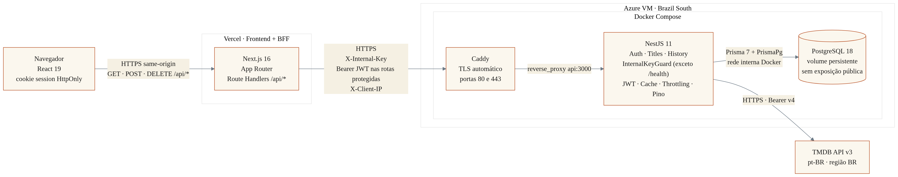

# Arquitetura do sistema — Plot Twist

> Projeto Guia de Streaming · Universidade Veiga de Almeida · Laboratório de Desenvolvimento de Software · 2026.1

## Visão geral

O Plot Twist adota o padrão BFF (Backend-for-Frontend). O navegador se comunica somente com o frontend Next.js por rotas same-origin em `/api/*`; ele não acessa diretamente a API NestJS. Essa divisão mantém os segredos e o token de sessão fora do JavaScript do cliente e oferece ao navegador um contrato ajustado à interface.

O Next.js reúne duas responsabilidades: renderiza a aplicação React e atua como BFF por meio de Route Handlers. A API NestJS é a camada de domínio: aplica autenticação, validações, limites de requisição, regras de histórico e integração com dados externos. O catálogo de filmes e séries vem da TMDB em português e para a região brasileira. Apenas contas e atividades dos usuários — avaliações, marcações de visto e favoritos — são persistidas no PostgreSQL.

## Diagrama de arquitetura

_Figura 1 — Arquitetura de produção do Plot Twist._

## Componentes e responsabilidades

| Componente | Responsabilidade | Tecnologia |
|---|---|---|
| Navegador | Exibir a interface, iniciar chamadas same-origin e manter a sessão por cookie seguro | React 19 |
| Next.js/Vercel | Renderizar o frontend, expor o BFF `/api/*`, ler o cookie e preparar chamadas à API | Next.js 16.2.9, App Router e Vercel |
| Caddy | Encerrar TLS, redirecionar HTTP para HTTPS e encaminhar tráfego para a API | Caddy em Docker |
| NestJS | Executar autenticação, catálogo, histórico, validação, cache, segurança e observabilidade | NestJS 11 |
| PostgreSQL | Persistir usuários, avaliações, vistos e favoritos | PostgreSQL 18, Prisma 7.8 e `PrismaPg` |
| TMDB | Fornecer catálogo, detalhes, gêneros, elenco e provedores disponíveis no Brasil | TMDB API v3, autenticação Bearer v4 |

## Fluxo das requisições

Em uma chamada pública de catálogo, como busca, descoberta ou gêneros, o navegador chama um Route Handler do Next. O BFF envia a requisição ao Nest por HTTPS, acrescentando `X-Internal-Key` e, quando disponível, `X-Client-IP`. O Nest consulta a TMDB com `language=pt-BR` e `region=BR`, normaliza a resposta e usa cache para reduzir latência e consumo da API externa. Busca, descoberta e gêneros ficam em cache por uma hora.

Em uma chamada autenticada, o BFF lê o JWT do cookie `session` e o encaminha como `Authorization: Bearer` apenas no salto Next → Nest. O token nunca é retornado ao JavaScript do navegador. Rotas de perfil e de histórico exigem esse Bearer interno; a ficha aceita o token opcionalmente para acrescentar o estado do usuário.

Nas escritas de avaliação, visto e favorito, o navegador usa `POST` ou `DELETE` no BFF. O Nest valida a sessão e aplica as regras de domínio antes de gravar pelo Prisma. Operações repetidas mantêm resultado consistente por `upsert` nas marcações e `deleteMany` nas remoções idempotentes.

Na ficha do título, detalhes e elenco são consultados na TMDB e mantidos em cache por 24 horas. Os provedores de assinatura, aluguel e compra são resolvidos pelo endpoint `watch/providers`, filtrados para o Brasil e armazenados em cache por 12 horas. A referência completa de rotas e respostas fica em `docs/api.md`.

## Segurança e observabilidade

O cookie `session` é `HttpOnly`, `SameSite=Lax`, `Secure` em produção e tem validade máxima de 24 horas. O BFF injeta a chave compartilhada `X-Internal-Key` em toda chamada ao Nest; o `InternalKeyGuard` global rejeita acessos sem a chave, exceto endpoints marcados como públicos, entre eles `/health`. O Bearer JWT circula somente entre os servidores.

O limite global é de 100 requisições por minuto, enquanto o login aceita cinco tentativas em 15 minutos. O `ValidationPipe` remove campos não permitidos e transforma entradas. Helmet aplica cabeçalhos de segurança. O Pino registra eventos com redação de authorization, cookie, chave interna, corpo, senha e tokens. O Caddy fornece TLS e redireciona HTTP para HTTPS. O PostgreSQL permanece fora da internet: a porta na VM está vinculada a `127.0.0.1` e a aplicação o acessa pela rede interna do Docker.

## Implantação e operação

O frontend é hospedado na Vercel. O backend roda em uma VM Azure na região Brazil South. A infraestrutura da VM é declarada em Bicep; suas regras de rede expõem apenas SSH, HTTP e HTTPS, sem regra para a porta 5432.

No backend, um fluxo do GitHub Actions aplica o Bicep, constrói a imagem, publica-a no GitHub Container Registry e conecta-se à VM por SSH. O Docker Compose inicia Caddy, NestJS e PostgreSQL. Depois da subida, o pipeline executa `prisma migrate deploy`. O volume nomeado `uva_db_data` preserva os dados do banco entre recriações dos contêineres. O processo atual do frontend não é documentado como auto-deploy permanente.

## Validação em produção

Verificação realizada em 27/06/2026 (Horário de Brasília), consultando `origin/main` do backend em `84be034764ea9e3524aaebd54eb5958a9d43c533` e do frontend em `62bfa5b3dbb5715c60c354b0f6fbef04ed0e0b5d`.

| Verificação | Resultado |
|---|---|
| Front publicado | `https://lab-dev-software-front.vercel.app` — 200; Home e ficha de Oppenheimer carregadas |
| API HTTPS `/health` | `https://api-uva.eduoncode.com/health` — 200 `{"status":"ok"}` |
| HTTP → HTTPS | `http://api-uva.eduoncode.com/health` — 308 para HTTPS |
| BFF `/api/genres` | `https://lab-dev-software-front.vercel.app/api/genres` — 200 |
| Nest `/genres` sem chave | `https://api-uva.eduoncode.com/genres` — 401 |

## Repositórios

- Backend: https://github.com/luizpassaroni/lab-dev-software-back
- Frontend: https://github.com/luizpassaroni/lab-dev-software-front
