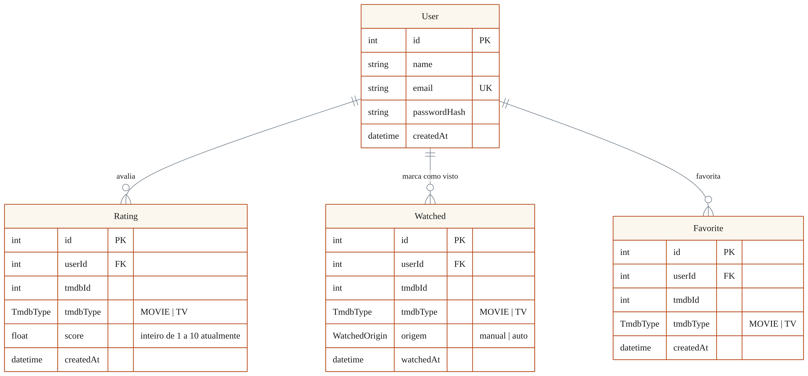

# Banco de dados — Plot Twist

> Projeto Guia de Streaming · Universidade Veiga de Almeida · Laboratório de Desenvolvimento de Software · 2026.1

## Visão geral

O Plot Twist usa PostgreSQL 18 com Prisma 7.8 e o adaptador `PrismaPg`. O modelo persistente é propositalmente pequeno: contém quatro entidades — `User`, `Rating`, `Watched` e `Favorite` — dedicadas à conta e às atividades de cada usuário.

O catálogo permanece na TMDB. Não existe tabela local de títulos, porque sinopse, elenco, imagens, gêneros e provedores são obtidos da fonte externa. As entidades de atividade guardam `tmdbId` e `tmdbType` para identificar o título na TMDB. Esses campos não são chaves estrangeiras locais; formam uma referência externa que distingue filmes (`MOVIE`) de séries (`TV`).

## Diagrama entidade-relacionamento

_Figura 1 — Modelo relacional do Plot Twist._

## Entidades e atributos

| Entidade | Finalidade | Atributos principais |
|---|---|---|
| `User` | Representar a conta local | `id`, `name`, `email`, `passwordHash`, `createdAt` |
| `Rating` | Armazenar a avaliação de um usuário para um título | `id`, `userId`, `tmdbId`, `tmdbType`, `score`, `createdAt` |
| `Watched` | Registrar a marcação de visto e sua origem | `id`, `userId`, `tmdbId`, `tmdbType`, `origem`, `watchedAt` |
| `Favorite` | Registrar um título como favorito | `id`, `userId`, `tmdbId`, `tmdbType`, `createdAt` |

Todas as entidades possuem chave primária inteira autoincrementada. `User.email` tem restrição de unicidade e a senha é persistida apenas como `passwordHash`. `Rating.userId`, `Watched.userId` e `Favorite.userId` são chaves estrangeiras para `User.id`.

## Relacionamentos e restrições

O modelo contém três relações 1:N: um usuário pode ter muitas avaliações, muitas marcações de visto e muitos favoritos. Cada atividade pertence a exatamente um usuário. As migrations materializam as três chaves estrangeiras com `ON DELETE RESTRICT`, impedindo a exclusão de um usuário ainda referenciado, e `ON UPDATE CASCADE`.

O enum `TmdbType` admite os valores `MOVIE` e `TV`. O enum `WatchedOrigin`, exclusivo de `Watched.origem`, admite `manual` e `auto`. Os tipos preservam no banco as mesmas categorias usadas pelas regras do backend e evitam valores livres nos respectivos campos.

> Rating, Watched e Favorite possuem unicidade composta `(userId, tmdbId, tmdbType)`. Assim, cada usuário mantém no máximo um registro de cada tipo para o mesmo título.

A composição inclui `userId`; o par `(tmdbId, tmdbType)` sozinho identifica apenas o título externo. Não há relação SQL entre esse par e uma tabela local de catálogo.

## Regras de negócio persistidas

Criar ou alterar uma avaliação usa `upsert` na unicidade composta. Na mesma transação, o backend garante uma marcação de visto: se ela ainda não existe, cria `Watched` com origem `auto`; se já existe, preserva sua origem. Portanto, uma marcação manual não é rebaixada quando o usuário avalia o mesmo título.

Marcar um título como visto também usa `upsert`. Quando já existe uma marcação automática, essa operação promove a origem de `auto` para `manual`, registrando a intenção explícita do usuário. Ao remover uma avaliação, a aplicação usa `deleteMany` e exclui somente a marcação de visto cuja origem seja `auto`; uma marcação manual permanece.

Não é permitido desmarcar um título como visto enquanto houver avaliação ativa. O serviço consulta `Rating` dentro de uma transação e responde com conflito HTTP 409 quando encontra a avaliação. Sem avaliação, a remoção do visto é idempotente por `deleteMany`.

O favorito é independente da avaliação e do visto. Sua inclusão usa `upsert`, e sua remoção usa `deleteMany`; repetir qualquer uma dessas intenções não cria duplicatas nem exige que o cliente conheça o estado anterior.

O campo `Rating.score` é `Float` no banco, mas o DTO atual aceita apenas valores inteiros de 1 a 10. Essa escolha mantém a regra vigente e permite avaliações fracionárias futuras sem uma migration de tipo. Ela não altera o cálculo nem cria uma regra de agregação.

## Migrations

A migration `20260523123455_init` criou as quatro tabelas, suas chaves primárias, a unicidade de email, as três unicidades compostas e as chaves estrangeiras com as ações referenciais descritas.

A migration `20260618122517_history_enum_and_origem` criou os enums `TmdbType` e `WatchedOrigin`, converteu `tmdbType` nas três tabelas de atividade e acrescentou o campo obrigatório `origem` em `Watched`. Assim, o histórico passou a distinguir marcações manuais das geradas por avaliação.

## Operação em produção

O banco roda no contêiner `postgres:18-alpine`. O volume nomeado `uva_db_data` é montado em `/var/lib/postgresql` para persistência. Dentro do Docker Compose, a aplicação acessa o serviço em `postgres:5432` por meio de `DATABASE_URL`.

Na VM, a publicação de porta é restrita a `127.0.0.1:5432`; além disso, o Bicep não cria regra NSG para 5432. O banco, portanto, não recebe conexões da internet. O pipeline do backend executa `prisma migrate deploy` após subir os serviços e aguarda a disponibilidade da API e do PostgreSQL antes de considerar a implantação concluída.

## Fontes do modelo

- Schema: https://github.com/luizpassaroni/lab-dev-software-back/blob/main/prisma/schema.prisma
- Migration inicial: https://github.com/luizpassaroni/lab-dev-software-back/blob/main/prisma/migrations/20260523123455_init/migration.sql
- Migration de enums e origem: https://github.com/luizpassaroni/lab-dev-software-back/blob/main/prisma/migrations/20260618122517_history_enum_and_origem/migration.sql
- Serviço de avaliações: https://github.com/luizpassaroni/lab-dev-software-back/blob/main/src/history/rating/rating.service.ts
- Serviço de vistos: https://github.com/luizpassaroni/lab-dev-software-back/blob/main/src/history/watched/watched.service.ts
- Serviço de favoritos: https://github.com/luizpassaroni/lab-dev-software-back/blob/main/src/history/favorite/favorite.service.ts
