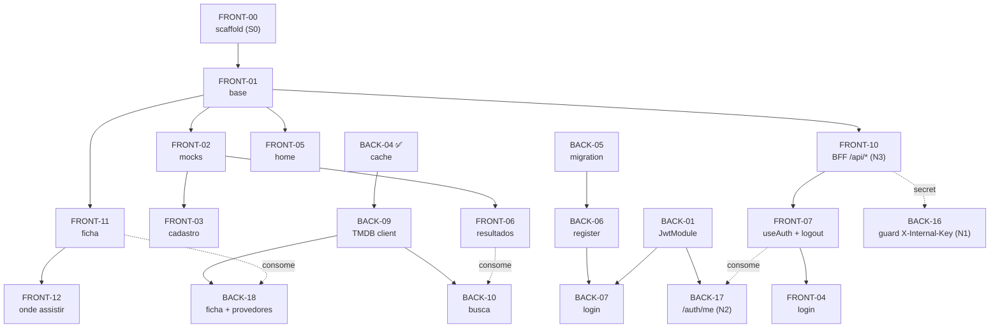

# Sprint 1 — Núcleo demonstrável (auth BFF + busca + ficha + onde assistir)

**Em uma frase:** o coração do produto funcionando ponta a ponta — criar conta, entrar, buscar um filme ou série, abrir a ficha e ver em quais streamings dá pra assistir no Brasil. Tudo rodando localmente (publicar o site é a Sprint 2).

> **Período:** 01–14/jun (2 semanas) · **Time:** back (Eduardo, Igor, João Victor, Lucas) + front (Carlos, Davi, Felipe, Gabriel Franciscone) + QA (Fernanda, Gabriel Santarello, Luiz Felipe) + PO (Caio)
> **Demo de fim de sprint:** criar conta → login → buscar "Oppenheimer" → abrir a ficha → ver onde assistir no Brasil. (Story arc fechado do núcleo.)
> **PRD canônico:** `docs/PRD.md` (§6, §8.1, §13.3). Dúvida de "por quê?" → PRD. Passo-a-passo de cada issue → `issues-back.md` / `issues-front.md`.

---

## Como ler (5 min)

- **Prioridade:** toda issue da S1 é **P0** — é o núcleo que tem que estar de pé pra demo + nota de 02/07 (legenda no PRD §0.3). Não há P1 nesta sprint.
- **Status:** ✅ feito · ⏳ pendente · ❓ a confirmar.
- **Termos canônicos** (ver `CONTEXT.md` na raiz do repo): **título** (filme/série), **ficha do título**, **onde assistir/provedor**, **BFF**, **sessão** (cookie `session`), **Bearer interno**, **chave interna** (`X-Internal-Key`). Não introduzir sinônimos (`mídia`, `token no localStorage`, `gateway`...).
- Esta página é o **índice + contrato** da sprint. O detalhe de execução vive na issue.

---

## Pré-requisito paralelo — Sprint 0

A Sprint 1 **assume** a Sprint 0 (`sprint-0-plan.md`): scaffold Next.js mergeado no front (`ISSUE-FRONT-00` / #10 — **ainda aberta em 01/06**) e infra do back concluída (`ISSUE-BACK-00` / #18 — **fechada**). A demo da S1 roda **localmente** — não depende do deploy publicado (isso é Sprint 2). Se o scaffold do front não fechar até o Dia 1, é o **primeiro bloqueio** a escalar.

---

## Escopo

**Dentro — 6 user stories + a infra de auth do BFF:**

- **US-1.1** Cadastro (email + senha, hash argon2/bcrypt, validação de nome).
- **US-1.2** Login (sessão via **cookie `session` HttpOnly setado pelo Next**; JWT 24h; rate limit 5/15min).
- **US-1.3** Logout (**100% no BFF** — o Next apaga o cookie; sem endpoint no Nest).
- **US-2.1** Busca de filmes **e** séries (TMDB `/search/multi`, "Carregar mais").
- **US-2.2** Ficha do título (sinopse, poster, elenco, duração/temporadas, nota TMDB, gêneros).
- **US-3.1** Onde assistir (provedores BR na ficha, com destaque visual).

**Fora desta sprint (não adiantar):**

- Avaliação, visto manual, favorito, perfil → **Sprint 2**.
- Gêneros/chips na home, dark/light final, responsivo → **Sprint 2**.
- Deploy publicado + HTTPS no back → **Sprint 2**.
- Refresh token, blocklist de logout, CSRF token, confirmação de email → **stretch / fora do MVP** (PRD §5.3).

---

## A arquitetura BFF — leia antes do Dia 1

O browser fala **só** com o Next (same-origin). O Next fala com o Nest **server-to-server** e é a **única** origem que o acessa; o Nest fica fechado pela **chave interna**. Toda chamada browser-facing da S1 — **auth + busca + ficha** — passa por **Server Actions** do Next (`"use server"`).

```
[Browser] ──same-origin──> [Next.js / BFF (Vercel)] ──server-to-server──> [Nest API (Azure VM)] ──> [TMDB]
   │  cookie `session` HttpOnly        │  X-Internal-Key (secret) +           │  Postgres
   │  (JS não lê o token)              │  Authorization: Bearer (só protegidas) +
   └─ nunca toca o Nest direto         │  X-Client-IP (IP real p/ rate-limit)
```

- **Dois guards no Nest:** (1) **chave interna `X-Internal-Key`** — guard **global**, em todas as rotas, roda **antes** do throttler (é a `ISSUE-BACK-16` / N1); (2) **JWT (Bearer)** — só nas protegidas, por ora `/auth/me` (é a `ISSUE-BACK-17` / N2).
- **Cookie `session`:** `HttpOnly; Secure; SameSite=Lax; Path=/; Max-Age=86400`, setado **só pelo Next**. O Nest **não** tem código de cookie.
- **Rate-limit no Nest** via tracker custom lendo `X-Client-IP` (confiável porque o secret garante a origem).
- Detalhe canônico: PRD §8.1.

---

## Contrato Dia-1 — 6 rotas browser-facing / 5 endpoints no Nest

Fechar **por escrito** no kickoff (vira `docs/contratos-api-s1.md` no repo back — `ISSUE-BACK-13`). Cada chamada tem **dois hops**: o front consome o lado `Browser → Next`; o Next acrescenta `X-Internal-Key` no lado `Next → Nest`.

> **Nota de implementação (2026-06-15):** a notação `/api/*` abaixo descreve o **contrato browser-facing** (corpos, status, cookies) — fonte de verdade dos payloads. Na implementação, o front expõe esse contrato via **Server Actions** do Next (`"use server"`), não como URLs `/api/*` públicas; o modelo de segurança (same-origin, cookie `session` HttpOnly, chave interna, sem token no browser) é idêntico.

| Rota | Browser → Next (`/api/*`) | Next → Nest |
|---|---|---|
| **register** | `POST /api/auth/register {name,email,password}` → `201 {id,name,email}` \| 400 \| 409. **Sem cookie.** | `POST /auth/register` (+secret) → `201 {id,name,email}` |
| **login** | `POST /api/auth/login {email,password}` → `200 {user}` **+ `Set-Cookie: session=<jwt>; HttpOnly; Secure; SameSite=Lax; Path=/; Max-Age=86400`** \| 401 \| 429 | `POST /auth/login` (+secret, +`X-Client-IP`) → `200 {access_token,user}` **no corpo, sem cookie** \| 401 \| 429 |
| **logout** | `POST /api/auth/logout` → `204` **+ `Set-Cookie: session=; Max-Age=0`**. Sem chamada ao Nest. | — |
| **me** | `GET /api/auth/me` (cookie automático) → `200 {user}` \| 401 | `GET /auth/me` (+secret, +`Authorization: Bearer <jwt-do-cookie>`) → `200 {user}` \| 401 |
| **search** | `GET /api/titles/search?q&page` → `200 {results,page,totalPages,hasMore}` \| 400 \| 502 | `GET /titles/search?q&page` (+secret) → mesmo payload |
| **ficha** | `GET /api/titles/:type/:id` → `200 {…detalhes, providers}` \| 404 \| 502 | `GET /titles/:type/:id` (+secret) → mesmo payload |

> O browser guarda só **`user`** em memória (estado React). Após F5, re-resolve via `GET /api/auth/me`. **Sem token no `localStorage`, sem Bearer saindo do browser.**

---

## Telas — front

| Tela | Conteúdo principal | Estado vazio / borda |
|---|---|---|
| **Cadastro** (`/cadastro`) | Form nome/email/senha + "Criar conta" + link "Já tenho conta". Validação inline. | 400 → erro no campo; 409 → "Este email já está cadastrado" |
| **Login** (`/login`) | Form email/senha + "Entrar" + link "Criar conta". | 401 → "Email ou senha inválidos"; 429 → "Muitas tentativas, aguarde alguns minutos" |
| **Home** (`/`) | Logo + barra de busca proeminente. **Sem chips/destaques/tema** (isso é S2). | "Digite algo na barra para começar" |
| **Resultados** (`/busca`) | Grade de cards: poster + título + ano + badge filme/série. "Carregar mais" no rodapé. | "Nenhum resultado para '<query>'. Tente outro termo." |
| **Ficha** (`/titulo/[type]/[id]`) | Sinopse, poster, elenco, duração/temporadas, nota TMDB, gêneros + **área "Onde assistir"** embutida. | 404 → "Título não encontrado" + link home |
| **Onde assistir** (na ficha) | Área destacada: logos dos provedores BR por categoria (flatrate/rent/buy). | "Este título não está disponível em provedores de streaming no Brasil." |

> **Logout** não é tela — é um botão no header (visível só logado) que chama `POST /api/auth/logout` e volta pra Home.

---

## Mapa da sprint por feature

Cada feature do núcleo é um par **front + back** que fecha junto. Esta tabela liga a user story → seção do PRD → as issues dos dois lados → o sinal de "pronto". É o melhor lugar pra ver **como o front e o back se encontram**.

| Feature (US) | PRD § | Front | Back | Pronto quando… |
|---|---|---|---|---|
| Cadastro (US-1.1) | §6, §8.1 | FRONT-03 | BACK-05, BACK-06 | cria conta; email repetido dá 409; sem cookie |
| Login + sessão (US-1.2) | §6, §8.1 | FRONT-04, FRONT-07, FRONT-10 | BACK-01, BACK-02, BACK-07, BACK-17 | login seta o cookie `session`; F5 mantém via `/api/auth/me`; 6ª tentativa em 15min dá 429 |
| Logout (US-1.3) | §6, §8.1 | FRONT-07, FRONT-10 | BACK-08 (só doc) | "Sair" apaga o cookie; `/api/auth/me` passa a responder 401 |
| Busca (US-2.1) | §6 | FRONT-05, FRONT-06, FRONT-10 | BACK-04, BACK-09, BACK-10 | buscar "Oppenheimer" lista cards com badge; "Carregar mais" acumula |
| Ficha (US-2.2) | §6 | FRONT-11, FRONT-10 | BACK-09, BACK-18 | abrir um título renderiza a ficha completa |
| Onde assistir (US-3.1) | §6 | FRONT-12 | BACK-18 | ficha mostra provedores BR; sem provedor → estado vazio sem quebrar |
| Fechar o back (N1) | §8.1 | — | BACK-16 | chamada ao Nest sem `X-Internal-Key` é rejeitada |
| Camada BFF (N3) | §8.1, §9.1 | FRONT-10 | — | toda chamada do browser passa pelos `/api/*` do Next |
| Qualidade (testes/erros) | §8 | FRONT-08, FRONT-09 | BACK-11, BACK-12 | cenários no Jest passam; erros e loading consistentes |
| Kickoff + env (meta) | §8.1 | — | BACK-13, BACK-14, BACK-15 | contrato dos dois hops fechado no Dia 1; `.env.example` com `INTERNAL_API_KEY` |

## Issues da Sprint 1

> 1–3 linhas de orientação por issue. Detalhe completo (contexto, contrato, critérios, guia de execução) na issue em `issues-back.md` / `issues-front.md`. Cada `#NN` linka direto pra issue no GitHub. **Toda a S1 já está publicada** (back #1–#14, #19, #24–#26; front #1–#13).

### Back — config / infra de auth

| ID | # | Épico | Título | US | Estado | Depende de |
|---|---|---|---|---|---|---|
| BACK-01 | [#1](https://github.com/luizpassaroni/lab-dev-software-back/issues/1) | infra | Bootstrap JwtModule + JWT_SECRET | US-1.2 | aberta | — |
| BACK-02 | [#2](https://github.com/luizpassaroni/lab-dev-software-back/issues/2) | infra | Throttler global + rate limit no login | US-1.2 | aberta | — |
| BACK-03 | [#3](https://github.com/luizpassaroni/lab-dev-software-back/issues/3) | infra | nestjs-pino + exception filter 5xx | RNF §8 | aberta | — |
| BACK-04 | [#4](https://github.com/luizpassaroni/lab-dev-software-back/issues/4) | infra | cache-manager + bootstrap do módulo titles | US-2.1 | ✅ fechada | — |
| **BACK-16** | [#24](https://github.com/luizpassaroni/lab-dev-software-back/issues/24) | infra | **Guard global de chave interna (`X-Internal-Key`)** — N1 | RNF §8.1 | aberta | — |

- **BACK-01** — `@nestjs/jwt` + `passport-jwt`, token 24h, secret do `.env`. Usa **extrator Bearer padrão** (`fromAuthHeaderAsBearerToken()`), **sem** cookie-parser (o cookie é do Next). *Já adiantado pelo PR #21 — conferir e completar, não refazer.*
- **BACK-02** — rate limit 5/15min no login via `@nestjs/throttler`, com `getTracker` **custom lendo `X-Client-IP`** (repassado pelo Next), não `req.ip`. Default global permissivo.
- **BACK-03** — logger estruturado antes dos endpoints, pra rate-limit-hit / senha-errada / 5xx da TMDB já saírem padronizados. Exception filter global pra 5xx não vazar stack. **Nunca logar senha/token/body de auth.**
- **BACK-04** — cache em memória (sem Redis). S1 usa só o TTL de busca (1h). Cria o módulo `titles/` esqueleto pra BACK-09/10/18.
- **BACK-16 (N1)** — `APP_GUARD` que valida o header `X-Internal-Key` (env `INTERNAL_API_KEY`) em **todas** as rotas, **antes** do throttler. Exceção: `/health`. É o que fecha o back contra acesso direto e torna o `X-Client-IP` confiável.

### Back — auth (endpoints)

| ID | # | Épico | Título | US | Estado | Depende de |
|---|---|---|---|---|---|---|
| BACK-05 | [#5](https://github.com/luizpassaroni/lab-dev-software-back/issues/5) | auth | Migration Prisma — name no User + email unique | US-1.1 | aberta | — |
| BACK-06 | [#6](https://github.com/luizpassaroni/lab-dev-software-back/issues/6) | auth | POST /auth/register | US-1.1 | aberta | BACK-05 |
| BACK-07 | [#7](https://github.com/luizpassaroni/lab-dev-software-back/issues/7) | auth | POST /auth/login (emite JWT no corpo) | US-1.2 | aberta | BACK-01, BACK-02, BACK-05/06 |
| BACK-08 | [#8](https://github.com/luizpassaroni/lab-dev-software-back/issues/8) | auth | Logout — documentar (sem endpoint no Nest) | US-1.3 | aberta | — |
| **BACK-17** | [#25](https://github.com/luizpassaroni/lab-dev-software-back/issues/25) | auth | **GET /auth/me + JwtStrategy + JwtAuthGuard** — N2 | US-1.2 | aberta | BACK-01, BACK-05 |

- **BACK-06** — cria conta, hash argon2/bcrypt, email único (409 em duplicado), valida nome/email/senha por DTO. **Sem auto-login** (cadastra → vai pro login), sem cookie.
- **BACK-07** — login local: compara senha com hash, em sucesso devolve **`{access_token, user}` no corpo** (server-to-server, **sem `Set-Cookie`** — o cookie é do Next). 401 genérico (não revela se email existe). *Realinhar o stub do PR #21: validar contra Prisma+bcrypt, senha mín. 8, **remover `/auth/refresh`** (refresh é stretch).*
- **BACK-08** — **não há endpoint** no Nest: o logout é tratado no BFF (o Next apaga o cookie `session`). A issue documenta isso no README pra ninguém implementar um `/auth/logout` no back achando que faltou. Sem blocklist (stretch §5.3).
- **BACK-17 (N2)** — endpoint protegido `GET /auth/me` que devolve `{user}` a partir do token (via `JwtStrategy` + `JwtAuthGuard`). Antecipa a infra de rota protegida que a Sprint 2 reusa (avaliar/favoritar). É o que rehidrata a sessão após F5.

### Back — catálogo (busca + ficha + onde assistir)

| ID | # | Épico | Título | US | Estado | Depende de |
|---|---|---|---|---|---|---|
| BACK-09 | [#9](https://github.com/luizpassaroni/lab-dev-software-back/issues/9) | catalogo | TMDB client base (HttpModule + token v4) | US-2.1 | aberta | BACK-04 |
| BACK-10 | [#10](https://github.com/luizpassaroni/lab-dev-software-back/issues/10) | catalogo | GET /titles/search (mix, cache 1h, "carregar mais") | US-2.1 | aberta | BACK-09 |
| **BACK-18** | [#26](https://github.com/luizpassaroni/lab-dev-software-back/issues/26) | catalogo | **GET /titles/:type/:id — ficha + provedores BR** | US-2.2 + US-3.1 | aberta | BACK-09 |

- **BACK-09** — cliente HTTP reutilizável pra TMDB (Bearer token v4, `language=pt-BR`, `region=BR`, base URL). Reusado por busca e ficha. Falha rápido no boot se faltar `TMDB_API_TOKEN`.
- **BACK-10** — `/search/multi` filtrando pessoa, normaliza pro contrato (poster/título/ano/badge), cache 1h por `(q,page)`, `hasMore = page < totalPages`. Erro da TMDB → 502 tratado, sem crash. Agora roda **atrás do guard de secret** (N1).
- **BACK-18 (ficha)** — `GET /titles/:type/:id` agrega num payload: **detalhes** (`/movie|tv/{id}`, cache 24h) + **provedores BR** (`/watch/providers?region=BR`, cache 12h). Cobre US-2.2 (ficha) **e** US-3.1 (dados de onde assistir). Estado "sem provedor BR" é resposta válida (lista vazia), não erro. 404 quando o título não existe na TMDB.

### Front

| ID | # | Épico | Título | US | Estado | Depende de |
|---|---|---|---|---|---|---|
| FRONT-01 | [#1](https://github.com/luizpassaroni/lab-dev-software-front/issues/1) | infra | Estrutura base (App Router + layout + header) | — | aberta | FRONT-00 (scaffold) |
| **FRONT-10** | [#11](https://github.com/luizpassaroni/lab-dev-software-front/issues/11) | infra | **Camada BFF — route handlers `/api/*`** — N3 | — | aberta | FRONT-01 |
| FRONT-02 | [#2](https://github.com/luizpassaroni/lab-dev-software-front/issues/2) | infra | Mock plan (auth.mock + titles.mock) | — | aberta | FRONT-01 |
| FRONT-03 | [#3](https://github.com/luizpassaroni/lab-dev-software-front/issues/3) | auth | Tela Cadastro (`/cadastro`) | US-1.1 | aberta | FRONT-01, FRONT-02 |
| FRONT-04 | [#4](https://github.com/luizpassaroni/lab-dev-software-front/issues/4) | auth | Tela Login (`/login`) | US-1.2 | aberta | FRONT-01, FRONT-02, FRONT-07 |
| FRONT-05 | [#5](https://github.com/luizpassaroni/lab-dev-software-front/issues/5) | catalogo | Tela Home (`/`) com barra de busca | US-2.1 | aberta | FRONT-01 |
| FRONT-06 | [#6](https://github.com/luizpassaroni/lab-dev-software-front/issues/6) | catalogo | Tela Resultados (`/busca`) + "Carregar mais" | US-2.1 | aberta | FRONT-01, FRONT-02 |
| FRONT-07 | [#7](https://github.com/luizpassaroni/lab-dev-software-front/issues/7) | auth | Hook useAuth + Logout no header | US-1.3 | aberta | FRONT-01, FRONT-10 |
| **FRONT-11** | [#12](https://github.com/luizpassaroni/lab-dev-software-front/issues/12) | catalogo | **Tela Ficha do título (`/titulo/[type]/[id]`)** | US-2.2 | aberta | FRONT-01, FRONT-02 |
| **FRONT-12** | [#13](https://github.com/luizpassaroni/lab-dev-software-front/issues/13) | catalogo | **Componente Onde assistir (na ficha)** | US-3.1 | aberta | FRONT-11 |
| FRONT-08 | [#8](https://github.com/luizpassaroni/lab-dev-software-front/issues/8) | testes | 2-3 testes de componente simbólicos | RNF §8 | aberta | FRONT-04, FRONT-06 |
| FRONT-09 | [#9](https://github.com/luizpassaroni/lab-dev-software-front/issues/9) | infra | Mensagens de erro & loading consistentes | RNF §8 | aberta | FRONT-03/04/06 |

- **FRONT-01** — layout global + header (logo + slot de busca + slot de auth). `src/types/api.ts` com os tipos dos contratos. **`LoginResponse` é `{user}`** (sem `access_token`); a URL do Nest **sai do browser** (vira env server-only no Next); `http.ts` aponta pra same-origin `/api/*`.
- **FRONT-10 (N3)** — **o maior trabalho novo do front.** Route handlers `app/api/auth/{register,login,logout,me}/route.ts` + `app/api/titles/search/route.ts` + `app/api/titles/[type]/[id]/route.ts`: leem o cookie `session`, injetam `X-Internal-Key`/`Bearer`/`X-Client-IP`, chamam o Nest (`API_INTERNAL_URL`), e (login/logout) setam/apagam o cookie. Envs **server-only**: `API_INTERNAL_URL`, `INTERNAL_API_KEY`.
- **FRONT-02** — mocks que retornam **exatamente** os contratos pra o front não esperar o back. `loginMock` devolve **`{user}`** (sem token). Mocks simulam os `/api/*`. Troca pro real é 1 linha.
- **FRONT-04** — login chama `/api/auth/login` (same-origin); **não persiste nada em `localStorage`**; no máximo guarda `user` via useAuth. 401/429 com mensagem genérica.
- **FRONT-07** — `useAuth()` **não guarda token**: `user` vem de `GET /api/auth/me` na montagem; `logout()` chama `POST /api/auth/logout` (await) e zera o estado. Header mostra "Olá, {nome}" + "Sair" se logado.
- **FRONT-11 (ficha)** — consome `GET /api/titles/[type]/[id]`; renderiza sinopse/poster/elenco/duração/nota/gêneros + embute o componente Onde assistir.
- **FRONT-12 (onde assistir)** — área destacada na ficha: logos por categoria (flatrate/rent/buy), estado "sem provedor BR".
- **FRONT-06** — chama `/api/titles/search` (same-origin); "Carregar mais" acumula; card clica pra `/titulo/[type]/[id]` (rota da FRONT-11).

### Testes + meta (back)

| ID | # | Épico | Título | US | Estado | Depende de |
|---|---|---|---|---|---|---|
| BACK-11 | [#11](https://github.com/luizpassaroni/lab-dev-software-back/issues/11) | testes | Testes auth.service (6 cenários + /auth/me) | US-1.1/1.2 | aberta | BACK-06, BACK-07, BACK-17 |
| BACK-12 | [#12](https://github.com/luizpassaroni/lab-dev-software-back/issues/12) | testes | Testes titles.service (3 cenários) | US-2.1 | aberta | BACK-10 |
| BACK-13 | [#13](https://github.com/luizpassaroni/lab-dev-software-back/issues/13) | meta | Kickoff Dia 1 — contratos em `docs/contratos-api-s1.md` | meta | aberta | — |
| BACK-14 | [#14](https://github.com/luizpassaroni/lab-dev-software-back/issues/14) | meta | `.env.example` consolidado (+`INTERNAL_API_KEY`) | meta | aberta | BACK-01, BACK-09, BACK-16 |
| BACK-15 | [#19](https://github.com/luizpassaroni/lab-dev-software-back/issues/19) | infra | README do back: deploy + variáveis | infra | aberta | BACK-00 |

- **BACK-11** — os 6 cenários do PRD §8 (cadastro OK / email dup / login OK retornando `{access_token,user}` no corpo / senha errada / email inexistente com **mesma** mensagem / rate-limit na 6ª com `X-Client-IP`) **+ cenário do `/auth/me`** (Bearer válido → `{user}`; sem Bearer → 401).
- **BACK-13** — fecha os **dois hops** das 6 rotas por escrito. Artefato em `docs/contratos-api-s1.md` (versionado no repo back). Front lê via raw URL.
- **BACK-14** — `.env.example` consolidado com `DATABASE_URL`, `JWT_SECRET`, `TMDB_API_TOKEN`, **`INTERNAL_API_KEY`**, `NODE_ENV`. Comentário de uma linha por variável.

---

## Grafo de dependências

Visão de "o que destrava o quê". **Setas cheias** = dependência de código dentro do mesmo repo (a de baixo só começa quando a de cima fecha). **Setas tracejadas** = integração via BFF (o front consome o back) — acontece na integração do Dia 8; antes disso o front roda contra mock, então não bloqueia.



> **Caminho crítico do front:** `FRONT-00 (#10) → FRONT-01 → FRONT-10 (BFF)` destrava todas as telas. Sem o scaffold (#10, ainda aberto), nada do front anda — por isso ele é o primeiro bloqueio a fechar.
> **Caminho crítico do back:** `BACK-05 → BACK-06 → BACK-07` (auth) e `BACK-09 → BACK-10/BACK-18` (catálogo) correm em paralelo; `BACK-16` (guard N1) fecha o back e deve estar de pé antes da integração do Dia 8.

## Sequência sugerida — 10 dias úteis

1. **Dia 1 — kickoff (call ~30min, back + front + PO):** fechar o **contrato dos dois hops** das 6 rotas (`ISSUE-BACK-13`). Front começa a mockar os `/api/*` **imediatamente**.
2. **Dias 2–7 (semana 1) — paralelo:**
   - **Back:** config (JwtModule, throttler, pino, cache, **guard de secret N1**) → `auth/` (register, login, **`/auth/me` N2**) → `titles/` (client, search, **ficha BACK-18**).
   - **Front:** estrutura base + **camada BFF (N3)** → telas Cadastro/Login contra mock → Home/Resultados/**Ficha** contra mock.
   - **Infra:** Eduardo segue `feat/infra-cicd` em paralelo, sem bloquear o resto.
3. **Dia 8 — integração:** front troca o mock pelos `/api/*` reais (Next chamando o Nest local/integração). Bugs de contrato resolvidos lado-a-lado. Testar **rehidratação** (`/api/auth/me` após F5) e **rate-limit** (`X-Client-IP`).
4. **Dias 9–10:** QA manual (Fernanda, Gabriel Santarello, Luiz Felipe) → ajustes → ensaiar a demo.

---

## Mock plan — anti-bloqueio

**Front não espera o back.** Cada tela roda contra um mock local que retorna **exatamente** o JSON do contrato. Quando o back termina a rota, o front troca só a importação — contrato batendo, zero retrabalho.

```ts
// src/services/auth.mock.ts  — BFF: login devolve só { user } (sem token)
export const loginMock = async (body: LoginBody) => ({
  user: { id: 1, name: "Mock User", email: body.email }
});
```

```ts
// troca de 1 linha na integração (Dia 8):
// import { loginMock as login } from "./auth.mock";
import { login } from "./auth.api"; // chama /api/auth/login (same-origin)
```

> Diferença vs. a versão antiga (pré-BFF): o mock simula os **route handlers `/api/*`** do próprio Next, e `loginMock` **não** devolve `access_token` — a sessão vive no cookie, não no browser.

---

## Quem faz o quê (confirmar no Dia 1)

- **Back (Eduardo, Igor, João Victor, Lucas):** dividir entre `auth/` (register/login/me + guards + throttler/jwt/pino) e `titles/` (client/search/ficha). PO sugere ~2 e 2. João Victor já tocou auth no PR #21 — natural seguir no `auth/`.
- **Front (Carlos, Davi, Felipe, Gabriel Franciscone):** Davi confirmou o BFF — natural puxar a **camada BFF (N3)**; os outros dividem Cadastro+Login, Home+Resultados, Ficha+Onde-assistir. Lib de UI é decisão do time de front.
- **QA (Fernanda, Gabriel Santarello, Luiz Felipe):** roteiro de teste manual a partir desta página + acompanhar a integração do Dia 8.
- **PO (Caio):** kickoff, desbloqueio, garantir que o mock plan roda e que PRD/sprint-plan/issues seguem alinhados.

---

## Critérios de "feito" da Sprint 1

- [ ] **6 rotas browser-facing** (`/api/auth/{register,login,logout,me}`, `/api/titles/search`, `/api/titles/:type/:id`) respondendo o contrato acordado, em local ou integração.
- [ ] **Cookie `session`** setado no login (pelo Next) e apagado no logout; **F5 mantém a sessão** via `/api/auth/me`; nenhum token no `localStorage`.
- [ ] Guard de **chave interna** ativo: chamada ao Nest sem `X-Internal-Key` é rejeitada (exceto `/health`).
- [ ] 6 telas navegáveis ponta-a-ponta contra o back real (Cadastro, Login, Home, Resultados, Ficha, Onde-assistir embutido).
- [ ] **6 cenários de `auth.service` + `/auth/me`** passando no Jest; **3 cenários de `titles.service`** passando.
- [ ] Demo end-to-end sem crash em call (criar conta → login → buscar "Oppenheimer" → ficha → onde assistir).
- [ ] Zero senha/token em log (checagem visual no PR — regra dura PRD §8).

---

## O que **não** está aqui

Justificativa de arquitetura, escopo total do MVP, RNF, riscos e roadmap → **PRD** (`docs/PRD.md`). Desenho canônico do auth → PRD §8.1. Passo-a-passo de cada issue → `issues-back.md` / `issues-front.md`. Esta página é pra ser lida em 5 min antes de começar a codar.
